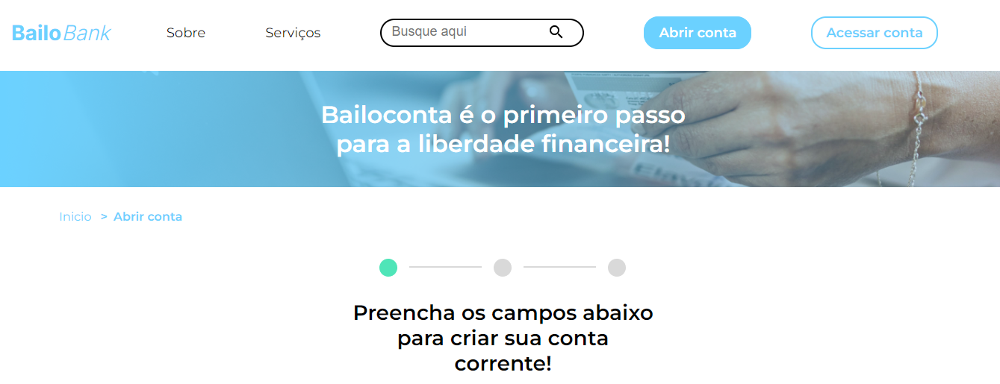
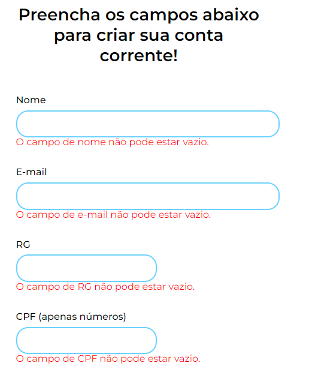
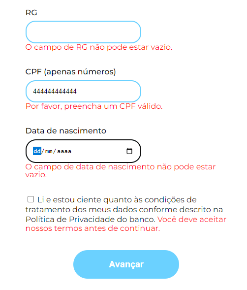
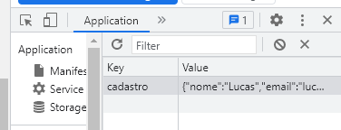

## Welcome! 👋

# Bookstore filters

This is a code from [Alura](https://www.alura.com.br). In this course, I learned how to manipulate DOM with JavaScript, create alerts, validate user information, use user webcam to take a picture, save user data in the localStorage.

### Screen Shots
- Header



- Forms - Error





- Register a picture of you


- Open Cam


- Local Storage




## Some code that I'm proud of
```js
formulario.addEventListener("submit", (e) => {
    e.preventDefault();

    const listaRespostas = {
        "nome": e.target.elements["nome"].value,
        "email": e.target.elements["email"].value,
        "rg": e.target.elements["rg"].value,
        "cpf": e.target.elements["cpf"].value,
        "aniversario": e.target.elements["aniversario"].value,
    }

    localStorage.setItem("cadastro", JSON.stringify(listaRespostas));

    window.location.href = './abrir-conta-form-2.html';

})
```

## Built with

- Semantic HTML5;
- CSS custom properties;
- JavaScript;

## Test the project yourself: [Teste the project here!!!](https://bailo-bank.vercel.app/)

### You can:

- Fill the form;
- Validate your information (CPF, age, email);
- Receive alerts if your inputs are not corrects;
- Take a picture of you;
- Receive a confirmation message!.

## Author

- Website - [My GitHub](https://github.com/lucasbailo)
- Frontend Mentor - [@lucasbailo](https://www.frontendmentor.io/profile/lucasbailo)
- Instagram - [@lucassbailo](https://www.instagram.com/lucassbailo/)
- LinkedIn - [Lucas Bailo](https://www.linkedin.com/in/lcsbailo)